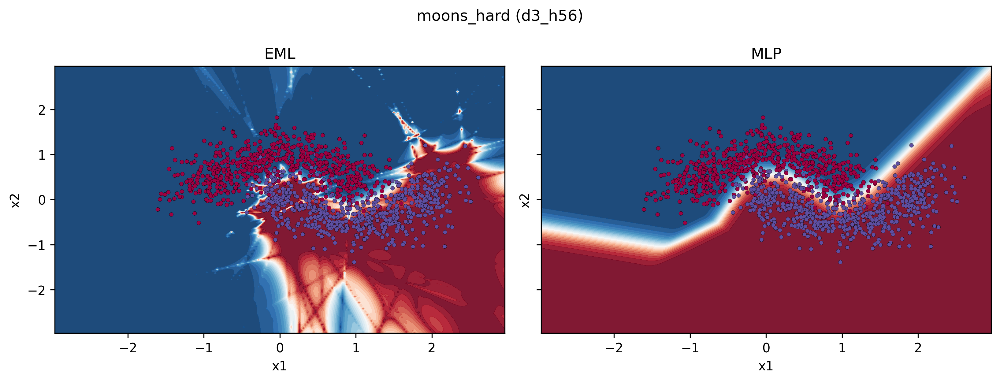
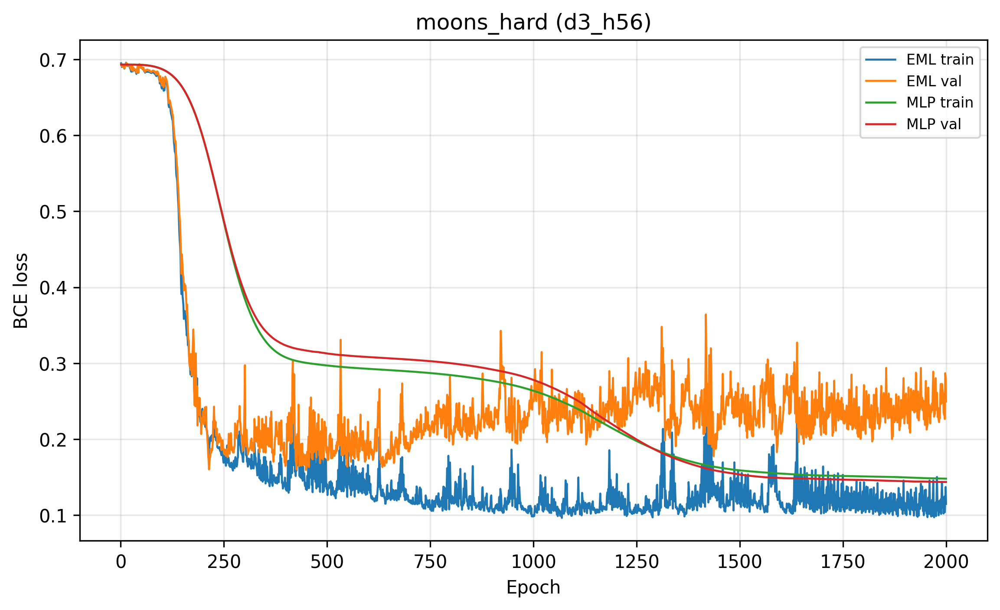
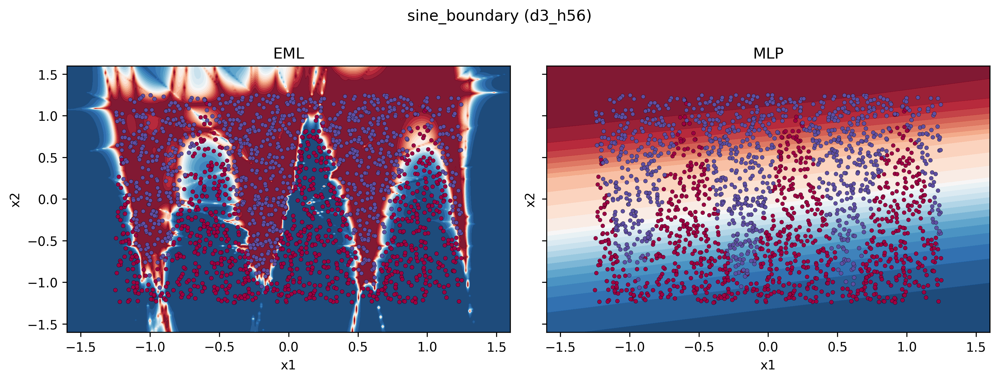
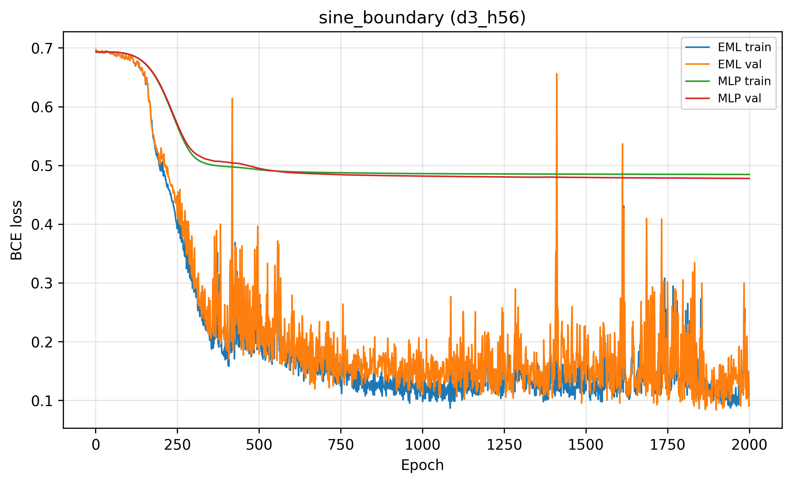
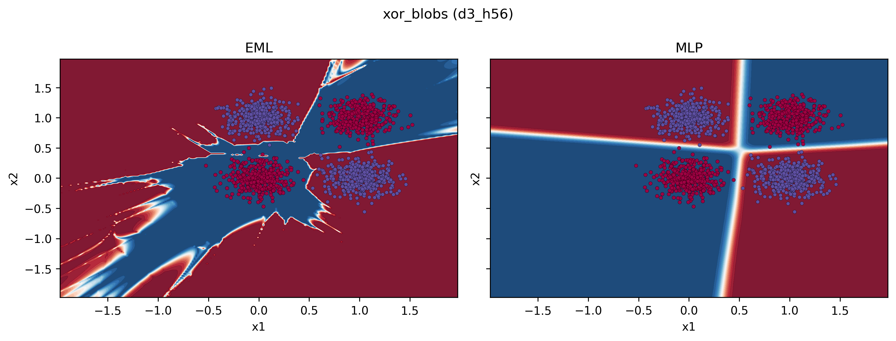
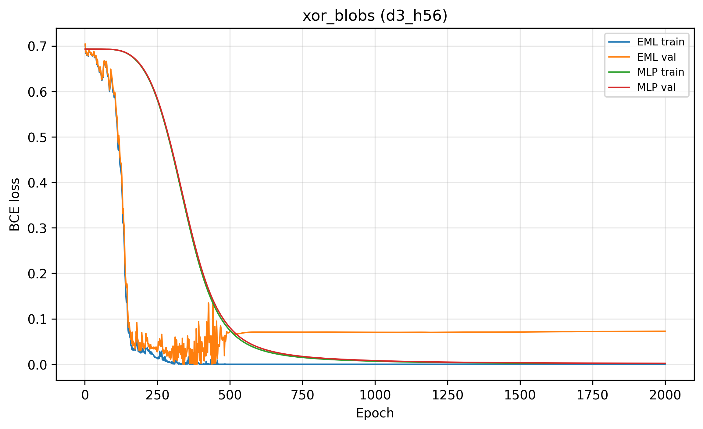

# EMLnet

PyTorch implementation of a **stabilized EML (exp − log) layer** with a **custom `autograd.Function`**: clamped forward ($\exp(\mathrm{clamp}(x)) - \ln(|y|+\epsilon)$) and **clamped outgoing gradients** in the backward pass, plus training scripts that compare **EML stacks** to **ReLU MLPs** on 2D classification toy datasets.


---

## Requirements

- Python 3.10+
- See [`requirements.txt`](requirements.txt) (`torch`, `numpy`, `matplotlib`, `scikit-learn`).

---

## Install

From the repository root, enter this directory, then install:

```bash
cd EMLnet
pip install -r requirements.txt
```

---

## Usage

All commands assume the working directory is **`EMLnet/`** (this folder).

### Moons baseline (2 EML blocks vs 2-layer MLP)

```bash
python -m emlnet_pkg.train_moons
```

| Flag | Default | Notes |
|------|---------|--------|
| `--epochs` | 15000 | Use `--epochs 500` for a quick run |
| `--hidden` | 32 | Wider hidden = more parameters |
| `--lr` | 1e-4 | Lower if you see NaNs |
| `--no-plots` | off | Skip figure export |

**Outputs:** [`plots/`](plots/) — `moons_loss_linear.png`, `moons_loss_logy.png`, `moons_accuracy.png`, `moons_grad_norm.png`, `moons_decision_eml_mlp.png`, `moons_summary_grid.png` (300 dpi).

### Multi-scenario benchmarks (deeper nets, harder 2D sets)

```bash
python -m emlnet_pkg.train_benchmarks --scenarios all --epochs 6000 --depth 3 --hidden 56
python -m emlnet_pkg.train_benchmarks --scenarios xor_blobs,spiral,circles --epochs 4000
```

- **Plots:** `plots/benchmarks/<scenario>/` (loss, log-loss, accuracy, grad norm, decision regions, summary grid, **val loss gap** = MLP val BCE − EML val BCE).
- **Tables:** `plots/benchmarks/summary.json`, `plots/benchmarks/summary.csv`.

Scenario keys are defined in [`emlnet_pkg/datasets_scenarios.py`](emlnet_pkg/datasets_scenarios.py). Use `--scenarios all` to run every registered scenario.

### Static results site (HTML + CSS)

A deployable bundle lives in [`site/`](site/): [`site/index.html`](site/index.html), [`site/styles.css`](site/styles.css), [`site/data/results.json`](site/data/results.json), and [`site/assets/`](site/assets/) (flattened PNGs per scenario). See [`site/README.md`](site/README.md) for preview and refresh commands.

```bash
cd site && python -m http.server 8080
```

---

## Project layout

```text
EMLnet/
  README.md
  requirements.txt
  emlnet_pkg/
    eml_function.py      # EMLFunction + EMLFunctionConfig
    layers.py            # EMLLayer
    models.py            # Two-layer + deep EML / MLP classifiers
    init_utils.py        # Small-variance weight init
    training_core.py     # Shared training loop
    plotting.py          # Resolves EMLnet/plots/
    datasets_scenarios.py
    train_moons.py
    train_benchmarks.py
  site/                  # static HTML/CSS + bundled figures for deploy
  plots/                 # generated by training scripts
```

---

## Mathematical background

**Operator (unstable as-is):** $\mathrm{eml}(x,y) = \exp(x) - \ln(y)$. Problems: $\exp(x)$ overflows; $\ln(y)$ is singular for $y \le 0$ and stiff as $y \to 0^+$.

**Stabilized forward** (used in code):

```math
f = \exp(x_c) - \ln(y_a), \quad x_c = \mathrm{clamp}(x),\quad y_a = |y| + \epsilon.
```

**Gradients** (before extra stabilization):

```math
\frac{\partial f}{\partial x_c} = \exp(x_c), \qquad
\frac{\partial f}{\partial y_a} = -\frac{1}{y_a}.
```

Chain rule through `clamp` uses the usual gate on $x$; through $|y|$ use $\operatorname{sign}(y)$. This repo **clips** the final `grad_x` and `grad_y` returned from [`EMLFunction.backward`](emlnet_pkg/eml_function.py) (configurable via `EMLFunctionConfig`) to limit explosion.

---

## Training defaults (both trainers)

- **Optimizer:** `AdamW`
- **Loss:** `BCEWithLogitsLoss` (binary 2D tasks)
- **After `backward`:** `clip_grad_norm_(..., max_norm=1.0)` (default)
- **Init:** tight Gaussian on linear weights (`--init-std` in benchmarks; `train_moons` uses `0.01`)

EML stacks use **more parameters** than a width-matched MLP because each `EMLLayer` uses two linear maps into $(x,y)$; scripts log both counts.

---

## Current benchmark results

Latest full run (saved in [`plots/benchmarks/summary.json`](plots/benchmarks/summary.json)):

```bash
python -m emlnet_pkg.train_benchmarks --scenarios all --epochs 2000 --depth 3 --hidden 56
```

- Scenarios evaluated: **19**
- Model sizes in this run: **EML 13,161 params** vs **MLP 6,609 params**
- Metric: `val_loss_gap_mlp_minus_eml = MLP val BCE - EML val BCE`
  - **Positive** gap: EML has lower validation loss
  - **Negative** gap: MLP has lower validation loss

Best EML-validation-loss gaps (positive):

- `sine_boundary`: **+0.3848** (EML val loss 0.0928 vs MLP 0.4776)
- `moons_clean`: **+0.1963** (EML val loss 0.00035 vs MLP 0.1967)
- `spiral`: **+0.0312** (both weak in absolute terms; EML slightly better val loss)
- `circles_tight`: **+0.00078** (both near-perfect)
- `swiss_roll_slice`: **+0.00098** (both near-perfect)

Largest MLP-validation-loss gaps (negative):

- `radial_waves`: **-0.7388**
- `sign_product`: **-0.3415**
- `messy_blobs`: **-0.2437**
- `checkerboard`: **-0.1525**
- `moons_extra_noise`: **-0.1326**

Interpretation:

- EML is strong on some smooth/nonlinear boundaries (`sine_boundary`, `moons_clean`).
- MLP is stronger on several noisy or pattern-heavy cases in this configuration.
- This comparison is **not parameter-matched** (EML has ~2x parameters here); for fairer ablations, retune `--hidden` and/or depth per model family.

### Sample figures

**`moons_hard`**





**`sine_boundary`**





**`xor_blobs`**





Other scenarios live under [`plots/benchmarks/`](plots/benchmarks/) (same `d3_h56_*.png` naming per folder). The same figures (flattened names) are bundled for deploy in [`site/assets/`](site/assets/) when you refresh the static site (see [`site/README.md`](site/README.md)).

---

## Troubleshooting

1. **NaNs in forward:** lower `--lr`, increase $\epsilon$, tighten $x$ clamp range in `EMLFunctionConfig`.
2. **NaNs in backward:** tighten gradient clip constants in `EMLFunctionConfig`, lower `--lr`, keep `clip_grad_norm_`.
3. **Sanity:** both entrypoints log `torch.isfinite` on the first minibatch of logits.

---

## License

Specify a license in a root `LICENSE` file when you publish the repository (this folder does not ship one by default).
